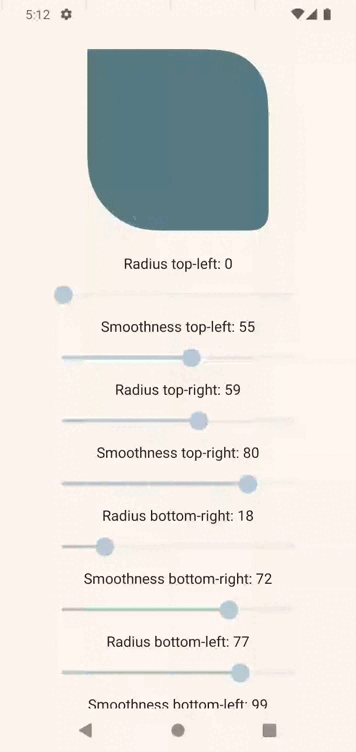

<h1 align="center">Smooth Corner Rect Android Compose</h1>
<p align="center"></p>
<p align="center">An Android Jetpack Compose Library which implements true smooth rounded corner rectangles also known as Squircles/Superellipses with custumizable radius and smoothness values for each individual corner.</p>

<p align="center">
  <a href="https://opensource.org/licenses/MIT"></a>
  <a href="https://android-arsenal.com/api?level=30"></a>
  <a></a>
  <a></a>
  <a></a>
  <a></a>
</p>

---

## Support me

I am proud to offer this resource for free, but if you wish to give some appreciation:
[](https://www.buymeacoffee.com/racra)

---

## Table of Contents

1. [How to add dependency](#how-to-add-dependency)
2. [Usage](#usage)
    1. [Creating a Squircle shape](#creating-a-squircle-shape)
    2. [Creating a Squircle shape with individual corner radius and smoothenss values](#creating-a-squircle-shape-with-individual-corner-radius-and-smoothenss-values)
3. [License](#license)

---

## How to add dependency

[](https://jitpack.io/#racra/smooth-corner-rect-android-compose)

Add the Jitpack repository to your root build.gradle file:

```groovy
allprojects {
  repositories {
    maven { url 'https://jitpack.io' }
  }
}
```

Also add the smooth-corner-rect-android-compose dependency to your app build.gradle:

```groovy
dependencies {
  implementation 'com.github.racra:smooth-corner-rect-android-compose:v1.0.0'
}
```

---

## Usage

Shapes created by this library can be used in themes and regular composables, check out the [sample](/app) app for a working demo of the library.

#### Creating a Squircle shape

```kotlin
Surface(
    modifier = Modifier
        .padding(25.dp)
        .height(200.dp)
        .width(200.dp),
    color = Color(0xFFF6EABE),
    shape = AbsoluteSmoothCornerShape(50.dp, 100)
) {}
```
#### Creating a Squircle shape with individual corner radius and smoothenss values

```kotlin
Surface(
    modifier = Modifier
        .padding(25.dp)
        .height(200.dp)
        .width(200.dp),
    color = Color(0xFFF6EABE),
    shape = AbsoluteSmoothCornerShape(
        100.dp, 100,
        5.dp, 50,
        100.dp, 100,
        5.dp, 50,
    )
) {}
```
---

## License

```
MIT License

Copyright (c) 2021 Rodrigo Alves

Permission is hereby granted, free of charge, to any person obtaining a copy
of this software and associated documentation files (the "Software"), to deal
in the Software without restriction, including without limitation the rights
to use, copy, modify, merge, publish, distribute, sublicense, and/or sell
copies of the Software, and to permit persons to whom the Software is
furnished to do so, subject to the following conditions:

The above copyright notice and this permission notice shall be included in all
copies or substantial portions of the Software.

THE SOFTWARE IS PROVIDED "AS IS", WITHOUT WARRANTY OF ANY KIND, EXPRESS OR
IMPLIED, INCLUDING BUT NOT LIMITED TO THE WARRANTIES OF MERCHANTABILITY,
FITNESS FOR A PARTICULAR PURPOSE AND NONINFRINGEMENT. IN NO EVENT SHALL THE
AUTHORS OR COPYRIGHT HOLDERS BE LIABLE FOR ANY CLAIM, DAMAGES OR OTHER
LIABILITY, WHETHER IN AN ACTION OF CONTRACT, TORT OR OTHERWISE, ARISING FROM,
OUT OF OR IN CONNECTION WITH THE SOFTWARE OR THE USE OR OTHER DEALINGS IN THE
SOFTWARE.
```
